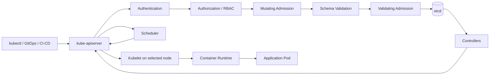
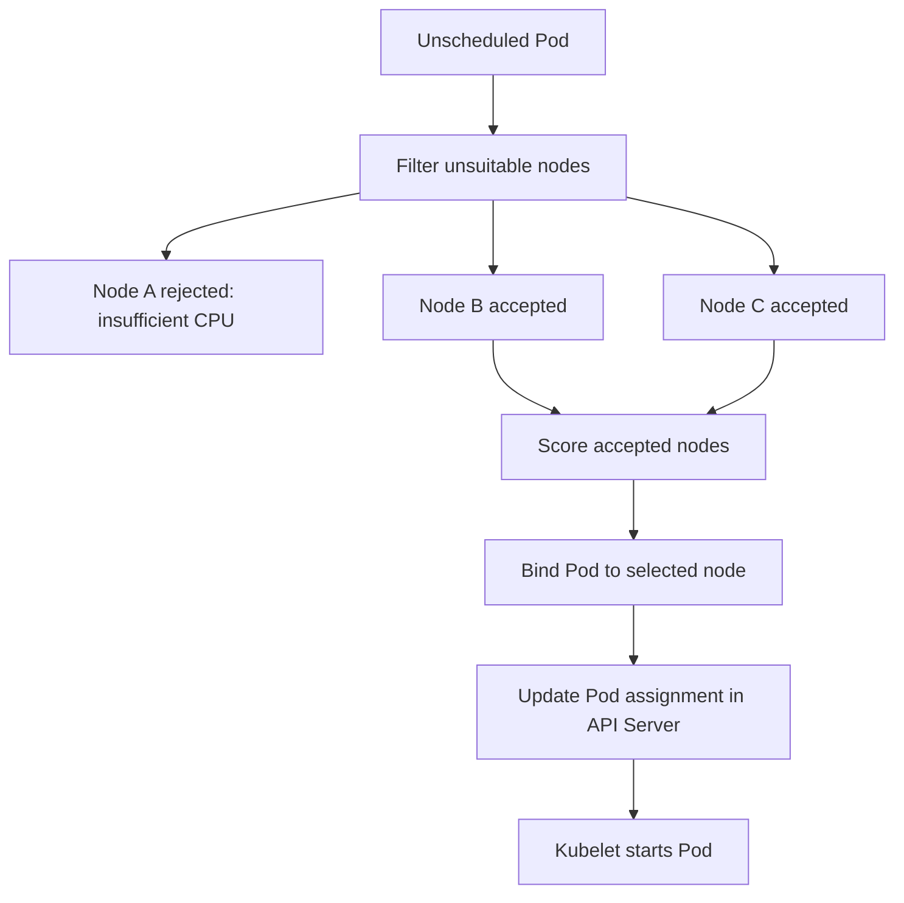

# Kubernetes Interview Revision Notes

Base syllabus: `README.md` – Principal Engineer Kubernetes/OpenShift/Istio 2-week revision plan.

This file will be updated **only after each day is completed**.

---

# Day 1 – Control Plane & API Internals

## Status

Completed in chat after user answered the Day 1 exercise.

---

## 1. Core Concept

Kubernetes is a **desired-state reconciliation system**.

You do not directly ask Kubernetes to run a container. You submit the desired state to the API Server. Kubernetes stores that desired state in etcd, and control-plane components continuously work to make the actual state match it.

Example:

```text
Desired state: Deployment should run 3 replicas.
Actual state: Only 1 Pod is running.
Controller action: Create 2 more Pods.
```

Senior interview point:

```text
The API Server stores and exposes desired state. Controllers, scheduler, and kubelet act on that state.
```

---

## 2. Control Plane Components

### kube-apiserver

The API Server is the front door of Kubernetes. Every request from `kubectl`, GitOps tools, controllers, scheduler, kubelets, operators, and CI/CD tools goes through it.

It handles:

- Authentication
- Authorization
- Admission control
- API validation
- Persistence to etcd
- Watches for controllers and cluster components

The API Server does **not** directly start containers.

### etcd

etcd is the strongly consistent key-value store for Kubernetes cluster state.

It stores:

- Pods
- Deployments
- Services
- Secrets
- ConfigMaps
- RBAC objects
- CRDs
- Node objects
- Status information

It does **not** store application database data.

### Controller Manager

The controller manager runs controllers that continuously reconcile desired state and actual state.

Example:

A Deployment controller notices a Deployment with 3 desired replicas. It ensures the related ReplicaSet exists. The ReplicaSet controller ensures the required number of Pod objects exists.

### Scheduler

The scheduler watches for Pods without a node assignment. It chooses the best node using filtering and scoring.

The scheduler only binds the Pod to a node. It does not start the container.

### Kubelet

The kubelet runs on each worker node. It watches the API Server for Pods assigned to its node, then asks the container runtime to start containers, sets up volumes and networking, and reports status back.

---

## 3. Architecture Diagram



---

## 4. What Happens After `kubectl apply -f deployment.yaml`?

### Deep Explanation

When you run:

```bash
kubectl apply -f deployment.yaml
```

`kubectl` sends the manifest to the API Server. The API Server does not immediately create containers. It first processes the request through the Kubernetes API request lifecycle.

The request goes through:

1. **Authentication** – Kubernetes checks who the caller is.
2. **Authorization** – Kubernetes checks whether the caller is allowed to perform the requested action.
3. **Mutating admission** – Webhooks or admission plugins may modify the object before storage.
4. **Schema validation** – Kubernetes validates that the object is structurally correct.
5. **Validating admission** – Webhooks or policies may reject the object.
6. **etcd write** – The object is persisted as desired state.
7. **Response to client** – The user receives success only after the API Server has persisted the object.
8. **Controller reconciliation** – Controllers see the change and create dependent objects.
9. **Scheduling** – Scheduler assigns unscheduled Pods to nodes.
10. **Kubelet execution** – Kubelet starts containers on the assigned node.

Important nuance:

- For create operations, the response is commonly `201 Created`.
- For update/apply operations, the response may be `200 OK`.
- The key interview point is that success is returned after the API object is accepted and persisted, not after the application container is fully running.

---

## 5. Corrected Interview Answer

The user answered:

```text
First it will authenticate and then authorisation will happen and then mutating webhook and then validating webhook after that write happens on etcd and the user receive status 200 once the write is done on etcd controller manager watches the changes and then the deployment creates the deployment which will create the replica set and then the pods in between the scheduler will decide where to place the pods based on filter and scoring and pod will be tied to the node and then kubelet will spin the pods
```

### Review

This answer is largely correct. It shows the right high-level flow:

- Authentication
- Authorization
- Admission
- etcd persistence
- Controller reaction
- Scheduler placement
- Kubelet execution

### Corrections

1. A Deployment does not create another Deployment. The **Deployment controller** creates/updates a **ReplicaSet**, and the ReplicaSet controller creates **Pod objects**.
2. The API response may be `201 Created` or `200 OK` depending on whether the object is created or updated.
3. The scheduler binds a Pod to a node by updating the Pod's node assignment. The kubelet then creates the Pod sandbox, sets up volumes/networking, and starts containers through the container runtime.

### Strong Interview Version

```text
When I run kubectl apply for a Deployment, the request first goes to the API Server. The API Server authenticates the caller, authorizes the requested action using RBAC or another authorizer, runs mutating admission webhooks, validates the object, runs validating admission webhooks, and then persists the desired state in etcd. Once the object is stored successfully, the client receives a success response.

After that, controllers watch the API Server. The Deployment controller creates or updates the ReplicaSet, and the ReplicaSet controller creates the required Pod objects. These Pods are initially unscheduled. The scheduler watches for Pods without a node assignment, filters unsuitable nodes, scores the remaining nodes, and binds each Pod to the best node. The kubelet on that node then observes the assigned Pod, pulls the image, prepares volumes and networking, starts the containers through the container runtime, and reports status back to the API Server.
```

---

## 6. Admission Controllers

Admission controllers are the final control layer before an object is stored in etcd.

### Mutating admission

Mutating admission can change the incoming object.

Examples:

- Inject Istio sidecar
- Add default labels
- Add default resource requests/limits
- Add security context
- Add default storage class

### Validating admission

Validating admission can reject the request.

Examples:

- Reject privileged containers
- Reject images from unapproved registries
- Reject Pods without resource requests
- Reject hostPath volumes
- Reject workloads missing required labels

### Production Importance

In a large enterprise platform, admission controllers enforce security, compliance, and platform standards automatically. They prevent unsafe workloads from entering the cluster.

### Summary

```text
Admission controllers protect the cluster before state reaches etcd. Mutating admission changes objects. Validating admission accepts or rejects objects.
```

---

## 7. etcd, Raft, and Quorum

etcd uses the Raft consensus algorithm.

One etcd member is elected as leader. Writes go through the leader and are replicated to followers. A write is committed only when a majority of members agree.

### Quorum Examples

```text
3 etcd members -> quorum is 2
5 etcd members -> quorum is 3
7 etcd members -> quorum is 4
```

This is why etcd usually runs with an odd number of members.

### What Happens If etcd Quorum Is Lost?

If quorum is lost, Kubernetes cannot reliably persist new state.

Impact:

- New Deployments may fail
- Scaling may fail
- New Pods may not be scheduled correctly
- Secret/ConfigMap updates may fail
- Controllers cannot reliably update status
- `kubectl` commands may time out

Existing Pods may continue running because containers already exist on worker nodes. However, if a Pod dies, Kubernetes may not be able to recreate it while etcd is unavailable.

### Strong Interview Answer

```text
If etcd quorum is lost, the Kubernetes control plane cannot safely persist state changes. Existing workloads may continue running, but new deployments, scaling, scheduling, and reconciliation are impacted. Recovery requires restoring etcd quorum or restoring from a valid etcd snapshot. I would check member health, network connectivity, disk state, leader status, and snapshot availability before taking recovery action.
```

---

## 8. Scenario: etcd Disk Full

### Production Impact

If etcd disk becomes full, etcd may stop accepting writes. The API Server then cannot persist cluster state changes.

Symptoms:

- `kubectl apply` fails or hangs
- Deployments do not progress
- Controllers lag
- Node status updates may fail
- Events may show persistence errors

### Common Causes

- Too many Kubernetes events
- Too many short-lived Jobs or Pods
- Large number of CRDs
- No regular compaction
- Excessive object churn
- Large Secrets or ConfigMaps
- No monitoring on etcd DB size

### Troubleshooting

Check API health:

```bash
kubectl get --raw='/readyz?verbose'
```

Check events:

```bash
kubectl get events -A --sort-by=.lastTimestamp
```

Check etcd metrics where available:

```text
etcd_mvcc_db_total_size_in_bytes
etcd_server_quota_backend_bytes
etcd_disk_wal_fsync_duration_seconds
etcd_server_has_leader
```

### Prevention

- Monitor etcd DB size
- Run compaction and defragmentation as per platform guidance
- Avoid storing large data in Secrets/ConfigMaps
- Clean up completed Jobs
- Reduce noisy event generation
- Watch CRD and operator churn

### Summary

```text
etcd disk full is a control-plane availability issue. Existing Pods may keep running, but the cluster may stop accepting new desired-state changes.
```

---

## 9. Scheduler Internals

The scheduler decides which node should run a Pod.

### Step 1: Filtering

Filtering removes nodes that cannot run the Pod.

Reasons a node may be filtered out:

- Not enough CPU
- Not enough memory
- Node selector mismatch
- Required node affinity mismatch
- Taints not tolerated
- Required pod anti-affinity mismatch
- Volume zone mismatch
- Node NotReady

### Step 2: Scoring

The scheduler scores remaining nodes and picks the best one.

Scoring can consider:

- Resource balance
- Topology spread
- Preferred affinity
- Image locality
- Available capacity

### Diagram



### Strong Interview Answer

```text
The scheduler watches for Pods without a node assignment. It first filters out nodes that cannot run the Pod based on resources, taints, tolerations, node selectors, affinity, anti-affinity, topology, and volume constraints. Then it scores the remaining nodes and selects the best one. Finally, it binds the Pod to that node through the API Server. The kubelet on the selected node then starts the Pod.
```

---

## 10. Scenario: API Server Latency Spike

### Symptoms

- `kubectl` commands are slow
- GitOps sync is slow
- Deployments take longer
- HPA reaction is delayed
- Operators lag
- Admission webhook timeout errors appear

### Root Cause Areas

#### etcd latency

If etcd is slow, API writes become slow.

Check:

- etcd disk latency
- etcd DB size
- fsync duration
- leader changes
- network latency between API Server and etcd

#### Admission webhook latency

A slow webhook can delay object creation.

Examples:

- Kyverno webhook slow
- OPA Gatekeeper unavailable
- Istio sidecar injector timeout
- Custom admission webhook unreachable

#### API request storm

This may come from:

- Bad CI/CD loop
- GitOps sync storm
- Misconfigured operator
- Too many short-lived Jobs
- Autoscaling churn

#### Watch pressure

Many controllers, operators, or CRDs can create heavy watch/list pressure on the API Server.

#### Audit logging overhead

Heavy audit logging can increase API Server latency in large clusters.

### Troubleshooting Commands

```bash
kubectl get --raw='/readyz?verbose'
kubectl get --raw='/livez?verbose'
kubectl get events -A --sort-by=.lastTimestamp
```

Metrics to check:

```text
apiserver_request_duration_seconds
apiserver_request_total
apiserver_admission_webhook_duration_seconds
etcd_request_duration_seconds
etcd_disk_wal_fsync_duration_seconds
```

### Strong Interview Answer

```text
For API Server latency, I would first identify whether the latency affects all API operations or only specific resources like Pod creation. If only Pod creation is slow, I would check admission webhooks, quota checks, image policy, and scheduler delay. If all API operations are slow, I would check API Server saturation, etcd latency, request volume, watch pressure, and audit logging overhead. I would use API Server readiness, metrics, events, and etcd metrics to narrow the issue.
```

### Summary

```text
API Server latency must be broken down by layer: API Server resources, etcd latency, admission webhook latency, request volume, watch pressure, and audit overhead.
```

---

## 11. Day 1 Final Summary

Remember this chain:

```text
User submits desired state
API Server authenticates, authorizes, admits, validates, and stores it
etcd persists the cluster state
Controllers reconcile desired state
Scheduler assigns Pods to nodes
Kubelet starts containers on the assigned node
```

Most important Day 1 takeaway:

```text
Kubernetes is a continuous reconciliation platform, not a one-time execution system.
```

---

## 12. Day 1 Self Check

Can I explain these clearly?

- API Server request flow
- Authentication vs authorization
- Mutating vs validating admission
- etcd Raft and quorum
- etcd quorum loss impact
- Scheduler filtering and scoring
- API Server latency troubleshooting
- Difference between API Server storing desired state and kubelet running containers

If yes, Day 1 is complete.
