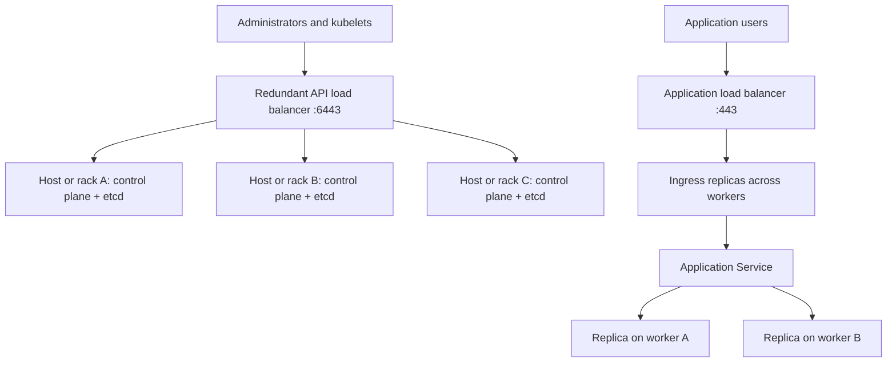
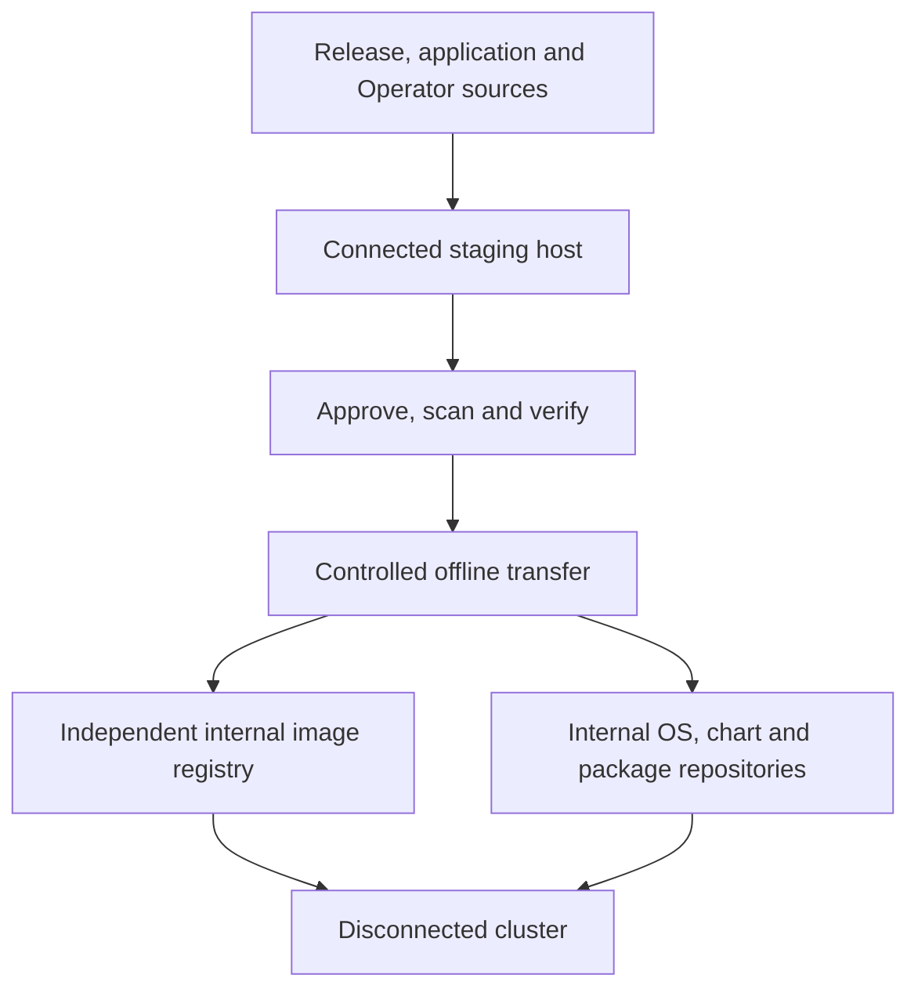
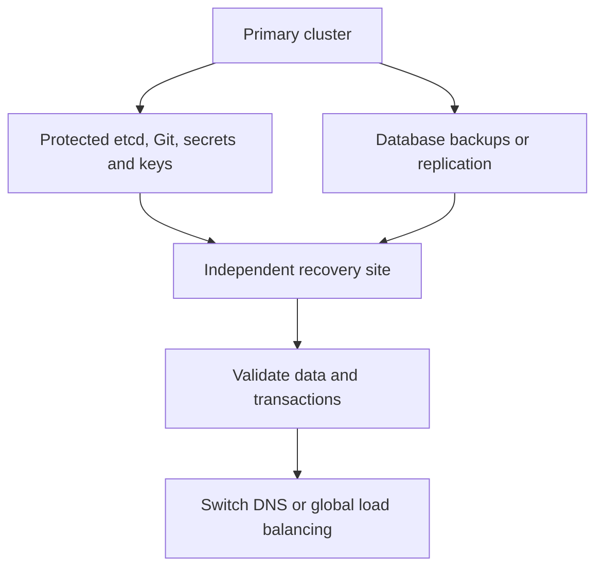
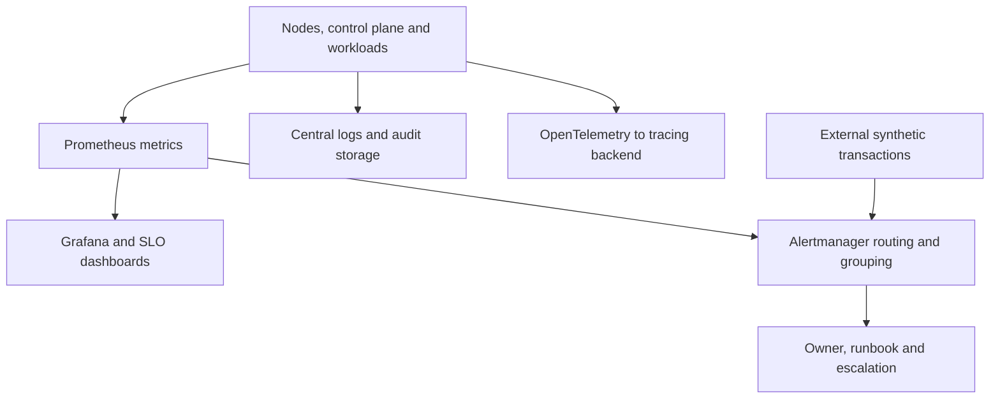
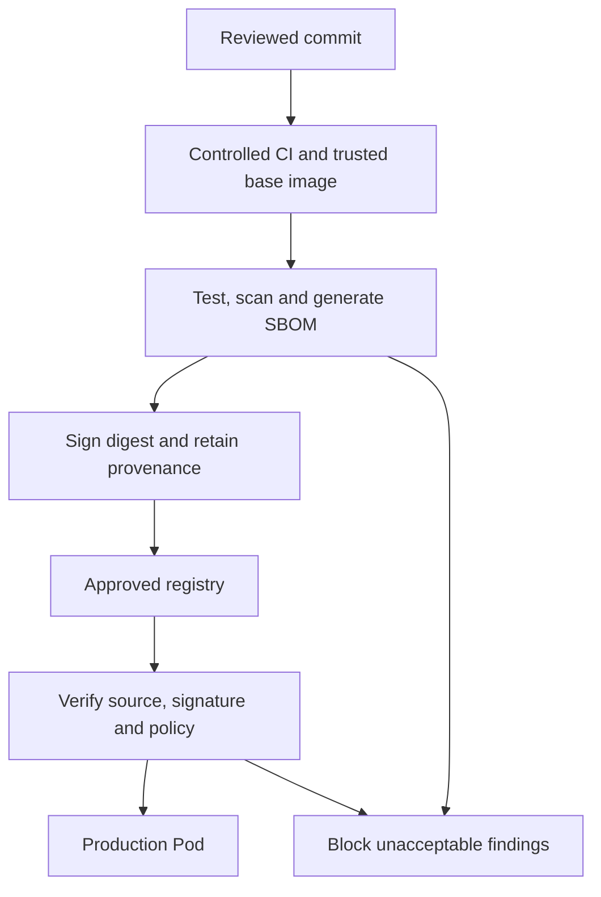
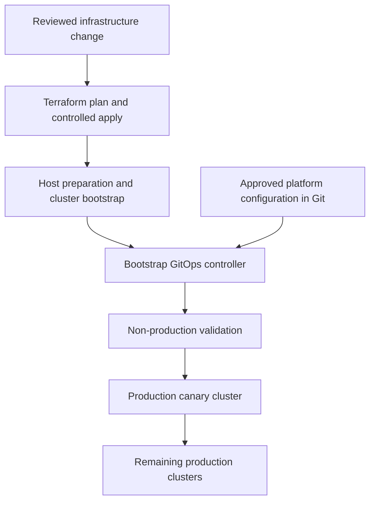

# HCLTech Section 18 — Kubernetes Architecture, Scenarios and Commands

Based on [Section 18 of the interview checklist](https://github.com/Johnybritto/Interview/blob/main/HCLTech_OnPrem_Kubernetes_Platform_Interview_Preparation.md). Covers all 19 scenarios in the original order. This is a separate revision guide; the Linux/runtime guide is unchanged.

## How to use this guide

For a two-minute answer: **requirements → design → implementation → failure handling → validation**. Use commands when the interviewer asks how you would perform or verify the operation.

Examples assume three control-plane nodes with stacked etcd, multiple workers, and internal DNS, registry and storage. Replace example names, addresses, versions and paths. Commands are interview/runbook examples, not one script to execute. Run host commands with the required privileges. Match installation, upgrade and recovery procedures to the deployed versions; OpenShift-managed components require OpenShift procedures.

## 1. Design an on-prem HA Kubernetes platform

**Opening:** “I first agree the availability target, workload size, failure domains and storage requirements. Then I remove single points of failure from both the control plane and application path.”



1. Reserve node, Pod and Service CIDRs without overlap; prepare DNS, NTP, routing, firewall rules and capacity.
2. Spread three control-plane nodes across physical failure domains. Three etcd members need two votes and tolerate one failure.
3. Configure a redundant API VIP/load balancer with health checks and a stable DNS name. Include that name in API certificate SANs.
4. Bootstrap the first node, join other control-plane nodes and workers, and install the selected CNI. Kubeadm itself does not install CNI.
5. Integrate CSI, ingress, registry trust, identity, policy, observability and backups. Size for a worker or failure-domain outage.
6. Test loss of one API server, a worker and an LB instance; verify application transactions throughout.

```bash
# On first control-plane node, after host/runtime prerequisites
sudo kubeadm init --control-plane-endpoint api.company.local:6443 \
  --upload-certs --pod-network-cidr 10.244.0.0/16
# Pod CIDR must match the chosen CNI configuration; use generated join commands.

# From an administrator context configured with the cluster kubeconfig
kubectl get nodes -o wide
kubectl get pods -n kube-system -o wide
kubectl get --raw='/readyz?verbose'
kubectl get storageclass
```

**Defend:** the API LB distributes requests to API servers; it does not load-balance etcd. Scheduler/controller-manager use leader election; etcd uses quorum. Existing workloads can continue during an API outage, but scheduling and reconciliation are impaired. Three VMs on one ESXi host are not host-level HA.

## 2. Design OpenShift on VMware or bare metal

**Design:** use the HA principles above, with OpenShift Operators controlling platform lifecycle.

1. Validate supported hardware/vSphere, IPs, storage integration and capacity.
2. Choose IPI for supported installer-provisioned infrastructure, UPI for infrastructure you provide, or Agent-based installation using a bootable ISO.
3. Prepare `api.<cluster>.<domain>`, `api-int.<cluster>.<domain>` and `*.apps.<cluster>.<domain>`. API traffic normally uses 6443; machine configuration uses 22623 internally; application ingress uses 80/443. Reachability and endpoint ownership depend on installation method.
4. Spread control-plane hosts and router replicas. On VMware use VM anti-affinity across ESXi hosts; on bare metal use rack, power and switch diversity.
5. Configure OVN-Kubernetes, CSI, OAuth/enterprise identity, trusted CAs, ingress certificates and monitoring.
6. Validate Operators, nodes, Routes and dynamic PVC provisioning.

```bash
# IPI example: prepared install-config.yaml in this directory
openshift-install create cluster --dir ./cluster-install --log-level=info

# Alternative Agent-based path: prepared install-config.yaml and agent-config.yaml
openshift-install agent create image --dir ./agent-install
# Boot intended hosts using the generated ISO, then monitor installation.
openshift-install agent wait-for install-complete --dir ./agent-install

# With the generated kubeconfig configured
oc get clusterversion
oc get clusteroperators
oc get nodes -o wide
oc get machineconfigpools
oc get routes -A
```

**Defend:** bootstrap services and load-balancer membership differ between installation methods. In workflows with a temporary bootstrap host, remove its API/machine-config backend entries after bootstrap completion. Do not run kubeadm upgrades on OpenShift.

## 3. Design an air-gapped platform



1. Inventory release images, application images, Operators and related images, Helm charts, OS and language packages, tools and signatures.
2. Provide internal DNS, NTP, registry, repositories, CA trust and credentials. Keep the installation mirror registry independent of the cluster being built.
3. Mirror approved content on a connected host; retain image digests and scan results.
4. Transfer and import through the approved offline process.
5. Configure runtime/cluster mirror rules, internal CA trust and pull credentials. OpenShift uses release-appropriate ImageDigestMirrorSet/ImageTagMirrorSet and catalog resources.
6. Prove installation, application rollout and image pulls with external connectivity absent.
7. Repeat for upgrades, including intermediate releases and dependencies; monitor registry capacity and certificates.

```bash
# Generic copy of an approved image, preserving all architectures
skopeo copy --all docker://source.example.com/team/app:1.0 \
  docker://registry.company.local/team/app:1.0

# OpenShift oc-mirror v2 illustration; prepare a release-compatible imageset config
# Connected host: mirror to disk
oc mirror -c imageset-config.yaml file:///data/mirror --v2
# Disconnected host: after transferring that workspace/archive content
oc mirror -c imageset-config.yaml --from file:///data/mirror \
  docker://registry.company.local --v2
# Review generated cluster resources before applying them.
oc get imagedigestmirrorsets
oc get imagetagmirrorsets
oc get catalogsources -n openshift-marketplace
```

**Defend:** image mirroring alone is insufficient. Package downloads, DNS, time, CA chains and Operator dependency resolution must also work offline. `oc mirror` arguments and generated resources must match the installed plugin version.

## 4. Design a multi-tenant cluster

1. Map teams/environments to namespaces and enterprise identity groups.
2. Grant namespace-scoped Roles/RoleBindings; restrict cluster-admin.
3. Set ResourceQuota and LimitRange to control aggregate consumption and defaults.
4. Apply default-deny ingress/egress, then explicitly permit DNS and approved dependencies. Confirm the CNI enforces NetworkPolicy.
5. Enforce Pod Security admission in upstream Kubernetes or supported SCC assignments in OpenShift.
6. Use dedicated pools for special placement; separate clusters for stronger trust/compliance boundaries.
7. Automate the complete baseline through the IDP/GitOps workflow.

```bash
kubectl create namespace team-a
kubectl create quota team-a-budget -n team-a \
  --hard=requests.cpu=8,requests.memory=16Gi,limits.cpu=16,limits.memory=32Gi,pods=30
kubectl label namespace team-a pod-security.kubernetes.io/enforce=restricted
kubectl auth can-i create deployments -n team-a \
  --as=alice --as-group=team-a-developers
kubectl get resourcequota,limitrange,networkpolicy,rolebinding -n team-a
```

```yaml
# Default deny baseline; add explicit DNS/application allow policies before rollout.
apiVersion: networking.k8s.io/v1
kind: NetworkPolicy
metadata:
  name: default-deny
  namespace: team-a
spec:
  podSelector: {}
  policyTypes: [Ingress, Egress]
```

**Validate:** test both permitted and forbidden API/network actions using tenant identities. Impersonation tests require administrator impersonation rights and do not test the login flow itself.

**Your interview connection:** portal input → validation → GitLab repository/manifests → Argo CD → namespace, quotas and policy. Explain your ownership of namespace onboarding within the wider IDP team. Namespace and taints alone do not provide full security isolation.

## 5. Design a secure enterprise platform

| Layer | Architecture/control |
|---|---|
| Hosts | Approved OS, patching, limited administrative access, hardening |
| Identity | SSO, MFA at identity provider, least-privilege RBAC |
| Network | Restricted API, tenant segmentation, controlled ingress/egress |
| Workloads | Non-root, seccomp, dropped capabilities, restricted privilege |
| Images | Approved sources, scanning, signing, admission checks |
| Secrets | External secret management, encryption at rest, rotation |
| Operations | Audit logs, detection, exception ownership and expiry |

1. Agree the threat model and required baseline.
2. Enforce controls through templates and admission policy; start new policies in audit mode where appropriate.
3. Test representative applications and approve narrow, time-bound exceptions.
4. Monitor violations, rotate credentials and retain audit evidence.

```bash
kubectl auth can-i '*' '*' --as=alice --as-group=team-a-developers
kubectl get rolebindings,clusterrolebindings -A
kubectl get validatingwebhookconfigurations,mutatingwebhookconfigurations
sudo kubeadm certs check-expiration  # kubeadm-managed control plane only
oc get scc                         # OpenShift
oc get oauth cluster               # OpenShift identity configuration
```

**Defend:** a scanner detects issues; an admission policy can block a deployment. Base64 encoding of a Secret is not encryption. Certificate expiry checks do not prove the entire external PKI is healthy.

## 6. Design zero-downtime Kubernetes upgrades

**Opening:** “I target application continuity using replicas, healthy dependencies, spare capacity and staged upgrades; the upgrade command alone cannot guarantee it.”

1. Check supported one-minor-at-a-time upgrade path, API removals, skew and CNI/CSI/Operator compatibility.
2. Take and verify backups; rehearse recovery and upgrades in non-production.
3. Check readiness, graceful shutdown, topology spread, PDBs and capacity for eviction.
4. Upgrade control-plane nodes sequentially; preserve etcd quorum.
5. Upgrade a canary worker, validate, then proceed in small batches.
6. Gate each stage on API health, DNS/storage tests, error rates, latency and synthetic transactions.

### kubeadm sequence

Install the target kubeadm package from the approved repository first. Set `TARGET_VERSION` to the approved Kubernetes version, for example `vX.Y.Z`; the placeholder is not runnable. Package installation syntax/version strings depend on OS and repository.

```bash
# First control-plane node
sudo kubeadm upgrade plan
sudo kubeadm upgrade apply "$TARGET_VERSION"

# On EACH additional control-plane node after upgrading its kubeadm package
sudo kubeadm upgrade node

# Before updating kubelet/rebooting EACH control-plane node, one at a time
kubectl drain cp1 --ignore-daemonsets
# Upgrade kubelet and kubectl packages as applicable to the approved target.
sudo systemctl daemon-reload
sudo systemctl restart kubelet
kubectl uncordon cp1
kubectl get --raw='/readyz?verbose'
```

Run administrator commands from a working kubeconfig and host commands on the node being maintained. Repeat with the correct node name; complete and verify each node before continuing. See scenario 13 for workers. Control-plane static Pods are managed by kubelet and are not evicted by drain.

### OpenShift sequence

```bash
oc adm upgrade                  # Recommended/available update paths
oc get clusteroperators
oc get machineconfigpools
# After compatibility, backup, capacity and update-path gates pass:
oc adm upgrade --to="$TARGET_OCP_VERSION"
oc get clusterversion -w
```

The Cluster Version Operator coordinates platform updates; Machine Config Operator manages node changes. Monitor MachineConfigPools and Operators; avoid parallel manual host changes.

**Defend:** PDBs constrain eviction-based voluntary disruption; they do not prevent hardware failure or govern Deployment rolling-update availability. A routine in-place downgrade is not a recovery promise: plan supported restoration, node replacement or migration to another cluster.

## 7. Design Kubernetes disaster recovery

Define **RPO** (acceptable data loss) and **RTO** (acceptable recovery time), then choose backup/rebuild, warm standby or active service at a secondary site.



1. Inventory applications and dependencies, including identity, registry and external databases.
2. Protect infrastructure code, cluster state, manifests, keys and application data off-site.
3. Document whether you restore the original cluster or rebuild a new cluster and restore applications. These are distinct recovery paths.
4. Recover infrastructure and cluster first; restore storage/data and dependencies, then applications.
5. Fence the failed primary to avoid dual writers; validate consistency before switching traffic.
6. Drill failover and failback; record measured RPO/RTO.

```bash
kubectl --context=dr get nodes
kubectl --context=dr get pods,pvc -A
kubectl --context=dr get --raw='/readyz?verbose'
curl --fail --cacert company-ca.pem https://app-dr.company.local/health
```

**Defend:** etcd is Kubernetes state, not the contents of application PVs. Independent clusters normally suit distant sites better than stretching etcd over a high-latency WAN. A successful backup job is not proof of a successful recovery.

## 8. Recover etcd — health, backup, verification and restore

### Decide the failure branch first

| Three-member cluster | Action |
|---|---|
| One member unavailable; two healthy | Diagnose or replace the failed member; retain live cluster state |
| Two unavailable | Quorum lost; first try to recover existing members |
| Quorum unrecoverable | Controlled disaster recovery from a verified snapshot |

Check network reachability (client 2379, peers 2380), disk latency/space, time, certificates and logs. Without quorum, writes fail; running application containers may continue but the control plane cannot function normally.

### A. kubeadm: health and snapshot

Run on a control-plane host in a root shell with compatible `etcdctl`/`etcdutl` installed. Paths below are the usual kubeadm stacked-etcd paths; check the actual static Pod manifest.

```bash
export ETCDCTL_API=3
export ETCDCTL_ENDPOINTS=https://127.0.0.1:2379
export ETCDCTL_CACERT=/etc/kubernetes/pki/etcd/ca.crt
export ETCDCTL_CERT=/etc/kubernetes/pki/etcd/healthcheck-client.crt
export ETCDCTL_KEY=/etc/kubernetes/pki/etcd/healthcheck-client.key

etcdctl endpoint health --cluster
etcdctl endpoint status --cluster -w table
etcdctl member list -w table
etcdctl alarm list

install -d -m 700 /secure-backup
ETCD_SNAPSHOT="/secure-backup/etcd-$(date -u +%Y%m%dT%H%M%SZ).db"
etcdctl snapshot save "$ETCD_SNAPSHOT"
etcdutl snapshot status "$ETCD_SNAPSHOT" -w table
sha256sum "$ETCD_SNAPSHOT"
```

Save from one healthy endpoint. Copy the snapshot and checksum to protected off-host storage. Back up PKI, manifests and any API encryption-provider configuration/keys separately. The database can contain credentials: restrict and encrypt backup access. Snapshot status/checksum checks integrity; a restore drill checks usability.

### B. One failed member while quorum is healthy

1. Identify the failed member and confirm two healthy members.
2. Stop/fence the failed host so stale data cannot reappear unexpectedly.
3. Remove only that member through the documented replacement procedure.
4. Replace/rejoin the node and wait for the new member to catch up before more changes.

```bash
etcdctl member list -w table
# Mutating example: only after the failed member is positively identified
etcdctl member remove "$FAILED_MEMBER_ID"
```

For kubeadm stacked etcd, coordinate cleanup with the control-plane replacement procedure and let the supported `kubeadm join --control-plane` workflow add the replacement. Do not both manually add a member and independently join the same node. Do not restore an old snapshot over a healthy quorum.

### C. Full kubeadm stacked-etcd recovery

This is a coordinated outage operation. The command below illustrates the restore primitive; the surrounding host/manifests steps are essential.

1. Isolate the failed cluster. Stop **all** API servers and etcd instances before restoring; move their static Pod manifests outside the watched manifest directory and verify containers actually stop. Stopping kubelet alone may leave containers running.
2. Preserve original data directories and manifests outside active paths. Choose one verified snapshot and use it for every restored member.
3. On each control-plane host, restore into a **new, empty data directory**, with that host's unique name/peer URL and the same cluster membership/token.
4. Use a compatible etcdutl release supporting revision bump/compaction. Choose a bump larger than revisions possibly created since the snapshot; the value below is illustrative.

```bash
# On cp1; example peer IPs and names must match actual configuration/certificates
etcdutl snapshot restore /secure-backup/snapshot.db \
  --name cp1 \
  --initial-cluster 'cp1=https://10.0.0.11:2380,cp2=https://10.0.0.12:2380,cp3=https://10.0.0.13:2380' \
  --initial-advertise-peer-urls https://10.0.0.11:2380 \
  --initial-cluster-token cluster-recovery-20260928 \
  --data-dir /var/lib/etcd-restored \
  --bump-revision 1000000000 --mark-compacted
```

5. Repeat on cp2/cp3, changing name and local peer URL. Keep the same snapshot, membership and token; each host gets its own restored directory.
6. Update each etcd static Pod manifest so its hostPath mounts the restored directory at the container's configured `--data-dir`. Ensure member/peer settings, permissions, SELinux labels where applicable and certificates match. Do not merely change one command argument while leaving the mount pointed at old data.
7. Bring up restored etcd members, confirm quorum/health, then restart API servers and the remaining control-plane components. Do not reuse the old members alongside the restored cluster.
8. Validate API readiness, node status, controllers and application state; reconcile changes lost since the snapshot.

```bash
etcdctl endpoint health --cluster
etcdctl endpoint status --cluster -w table
kubectl get --raw='/readyz?verbose'
kubectl get nodes
kubectl get pods -A
```

**Why bump/compact?** Kubernetes controllers watch revisions. Restoring older state can leave caches assuming they already saw newer revisions. Bumping and marking compacted forces watchers to relist. Restoration creates a new etcd cluster identity; it does not merge the snapshot into a running cluster.

### D. OpenShift backup and recovery — separate workflow

```bash
# From admin workstation, substitute one healthy control-plane node
oc debug node/<control-plane-node>
chroot /host
/usr/local/bin/cluster-backup.sh /home/core/etcd-backup
exit
exit
```

Protect and copy off-host **both** generated files: the etcd snapshot and static Kubernetes resource archive. Use the OpenShift backup/restore instructions for the exact release; the documented 4.20 workflow requires a backup from the same z-stream version, not just the same minor version.

For snapshot recovery, choose one recovery control-plane host, prepare the backup directory and stop/isolate the other control-plane components exactly as the release runbook directs. API access may be unavailable, so use host console/SSH access:

```bash
# On the designated recovery host, only after the release-specific prerequisites
sudo -E /usr/local/bin/cluster-restore.sh /home/core/etcd-backup
# Complete documented peer recovery and Operator reconciliation, then:
oc get clusteroperators
oc get pods -n openshift-etcd -o wide
oc get nodes
```

**Defend:** this script is one step, not the entire recovery. OpenShift distinguishes unhealthy-member replacement, quorum recovery from surviving data and restoration to a previous snapshot. Choose the documented branch; do not apply the generic kubeadm restore recipe to OpenShift.

## 9. Handle a private registry outage

**Impact:** running containers generally continue; new deployments, scaling and rescheduling may fail on image pulls.

1. Establish affected registries, namespaces and nodes; inspect Pod events.
2. Check DNS, CA/TLS, authentication, LB, registry services and backing storage/database.
3. Pause nonessential rollouts and maintenance that require new pulls.
4. Restore service or use a preconfigured trusted replica containing the exact required digests.
5. Pull from an uncached node and resume workloads gradually.

```bash
kubectl describe pod <affected-pod> -n <namespace>
getent hosts registry.company.local
curl -I --cacert company-ca.pem https://registry.company.local/v2/
openssl s_client -connect registry.company.local:443 \
  -servername registry.company.local -CAfile company-ca.pem </dev/null
# On a node, with approved credentials configured if required
sudo crictl pull registry.company.local/team/app@sha256:<digest>
```

A registry `/v2/` response of 401 can mean the service is reachable but authentication is required; it does not prove image access. A host-level `crictl pull` does not automatically use a Pod's imagePullSecret, so test a real Pod as well.

**Defend:** deploy redundant registry services and resilient backing storage, and monitor certificates. Cached images are partial protection: `Always` normally still contacts the registry to resolve the reference.

## 10. Handle DNS failure

**Architecture:** Pod resolver → cluster DNS Service → CoreDNS/managed DNS → Kubernetes records or upstream enterprise DNS.

1. Determine whether cluster names, upstream names or API/application public records fail.
2. Test inside the affected Pod/namespace; compare with another node.
3. Check resolver settings, DNS Pods, Service and EndpointSlices.
4. Verify service routing/CNI and NetworkPolicy for UDP **and TCP** 53.
5. If only upstream names fail, inspect forwarders and enterprise DNS; if one node fails, inspect its networking/DNS path.

```bash
kubectl exec -n <namespace> <pod> -- cat /etc/resolv.conf
# Use an approved diagnostic Pod containing DNS utilities if app image lacks them
kubectl exec -n <namespace> <diagnostic-pod> -- nslookup kubernetes.default.svc.cluster.local
kubectl exec -n <namespace> <diagnostic-pod> -- nslookup registry.company.local
kubectl get pods -n kube-system -l k8s-app=kube-dns -o wide
kubectl get svc kube-dns -n kube-system
kubectl get endpointslices -n kube-system -l kubernetes.io/service-name=kube-dns
kubectl logs -n kube-system -l k8s-app=kube-dns --tail=100
kubectl get configmap coredns -n kube-system -o yaml
# OpenShift
oc get clusteroperator dns
oc get pods -n openshift-dns -o wide
oc get dns.operator/default -o yaml
```

**Validate:** test short/FQDN service names and approved upstream names across nodes. Adjust example names for a custom cluster domain. Spread/size DNS replicas and consider supported NodeLocal DNSCache. Direct-IP comparison helps isolate DNS but HTTPS Host/SNI must still be correct.

## 11. Scale an overloaded cluster

1. Identify the bottleneck: CPU, memory, scheduling, API, storage, network or downstream dependency.
2. Inspect requests/limits, throttling, OOMs and Pending Pod events; fix bad sizing before scaling blindly.
3. Scale replicas using HPA with CPU, request rate or queue depth as appropriate.
4. Add suitable worker capacity when scheduling is resource-constrained; check IP and storage capacity too.
5. Validate throughput/latency, cost and downstream saturation after scaling.

```bash
kubectl top nodes
kubectl top pods -A --sort-by=cpu
kubectl get pods -A --field-selector=status.phase=Pending
kubectl describe pod <pending-pod> -n <namespace>
kubectl get hpa -A
# Example: requires resource metrics and meaningful CPU requests
kubectl autoscale deployment checkout -n shop --min=3 --max=10 --cpu-percent=70
```

**Defend:** `kubectl top` needs a metrics API; custom HPA metrics need an adapter. HPA creates replicas, node autoscaling creates machines, and neither invents available physical hardware. Pending Pods caused by taints, affinity or storage will not necessarily be fixed by more generic workers.

## 12. Add capacity without affecting applications

1. Provision hosts with compatible OS/runtime and sufficient network/storage resources.
2. Validate DNS, NTP, firewall, registry CA/authentication and CNI prerequisites.
3. Join with supported automation; register initially with a maintenance taint if validation must precede tenant scheduling.
4. Apply pool/topology labels and required taints.
5. Run tolerating canary Pods testing DNS, image pull, cross-node traffic and PVC attach/mount.
6. Remove the onboarding taint and admit normal workloads.

```bash
# On healthy kubeadm control plane; protect the generated short-lived token
sudo kubeadm token create --print-join-command
# Run returned command on prepared new worker, using actual values
sudo kubeadm join api.company.local:6443 --token <token> \
  --discovery-token-ca-cert-hash sha256:<hash>
kubectl get nodes -o wide
kubectl label node worker-new nodepool=general
# If node registered with this onboarding taint, remove after validation:
kubectl taint node worker-new maintenance=validation:NoSchedule-

# OpenShift: inspect infrastructure-managed provisioning, where available
oc get machines,machinesets -n openshift-machine-api
# Only for a supported MachineSet and available infrastructure capacity
oc scale machineset <worker-machineset> -n openshift-machine-api --replicas=4
```

**Defend:** not all OpenShift installations have MachineSet-managed workers. Adding a node does not automatically redistribute existing Pods. A taint applied only after join can leave a scheduling window; use registration-time configuration when this matters.

## 13. Upgrade workers without downtime

**Architecture:** maintain spare capacity or bring up a green worker pool; move workloads in controlled batches while the old pool remains available.

1. Check replicas, readiness, PDBs, topology, storage and spare capacity.
2. Cordon one canary worker and drain using the Eviction API.
3. Verify replacement Pods and application transactions on other nodes.
4. Upgrade kubeadm, run node upgrade, update kubelet/runtime/OS as approved, and reboot if needed.
5. Check readiness, CNI/CSI, image pulls and storage; uncordon and observe.
6. Proceed node by node; stop on application degradation.

```bash
# Administrator context
kubectl get pdb -A
kubectl cordon worker-01
kubectl drain worker-01 --ignore-daemonsets --timeout=10m

# On worker-01, AFTER installing target kubeadm package
sudo kubeadm upgrade node
# Install approved kubelet/runtime/OS packages as required
sudo systemctl daemon-reload
sudo systemctl restart kubelet

# Administrator context
kubectl wait --for=condition=Ready node/worker-01 --timeout=5m
kubectl uncordon worker-01
kubectl get pods -A -o wide
```

**Defend:** drain waits for eviction/deletion, not full business-transaction health. If PDB blocks eviction, repair replicas/capacity first. Do not blindly use force, disable-eviction or emptyDir deletion flags. DaemonSets remain; local PVs can constrain rescheduling. For OpenShift, use MCO/MachineConfigPool lifecycle controls and monitor `oc get mcp`; do not manually update RHCOS packages.

## 14. Recover a failed control-plane node

1. Confirm surviving API servers and etcd quorum; ensure LB health checks remove the failed API endpoint.
2. Check host, disk, runtime, certificates and static Pods; repair if practical.
3. If replacement is required, fence the old host and clean up its stale Node/member using the supported procedure.
4. Provision a compatible host and rejoin through the HA API endpoint.
5. Verify etcd health, API readiness and controller reconciliation before changing another node.

```bash
# On failed host, if accessible
sudo systemctl status kubelet
sudo journalctl -u kubelet --since '-30 min'
sudo crictl ps -a
df -h

# On healthy kubeadm control-plane node
sudo kubeadm token create --print-join-command
sudo kubeadm init phase upload-certs --upload-certs
# On prepared replacement: generated token/hash/certificate key are sensitive
sudo kubeadm join api.company.local:6443 --token <token> \
  --discovery-token-ca-cert-hash sha256:<hash> \
  --control-plane --certificate-key <certificate-key>
```

**Defend:** certificate upload is temporary; transfer/protect certificate material through the approved process. External-etcd topology has different membership responsibilities. For OpenShift use the platform-specific control-plane replacement procedure; do not improvise by deleting managed etcd members.

## 15. Design platform observability



1. Define user-facing SLIs/SLOs before selecting alerts.
2. Collect node/control-plane, ingress, network, storage and application metrics; centralize logs and traces.
3. Track API latency/errors, etcd peer health/disk latency, Pending Pods, storage latency, DNS errors and capacity.
4. Page on actionable impact/imminent failure; group related alerts, inhibit child alerts and use appropriate evaluation windows.
5. Add external checks and independent alert delivery; define retention and access controls.
6. Test an alert end to end and confirm the correct owner receives a useful runbook.

```bash
kubectl get events -A --sort-by=.metadata.creationTimestamp
kubectl logs -n shop deployment/checkout --since=15m
kubectl logs -n shop <pod> --previous
kubectl top nodes
oc get clusteroperator monitoring   # OpenShift
```

**Defend:** logs explain events, metrics show trends and traces follow requests. Short-lived events and ad hoc `top` output are not historical monitoring. A healthy dashboard inside a failed cluster cannot replace external detection.

## 16. Back up and restore stateful workloads

1. Inventory PVCs, database engines, secrets/keys and external dependencies.
2. Combine database-native backups/PITR with supported volume snapshots or file-system backups.
3. Quiesce where needed or use application-aware tooling; an arbitrary storage snapshot may only be crash-consistent.
4. Back up Kubernetes objects with the data; ensure independent/off-site retention.
5. Restore prerequisites/CRDs/operators, keys/configuration, data and applications in dependency order.
6. Validate records and transactions in isolation and measure recovery time.

```bash
kubectl get pvc -n shop
kubectl get pv,storageclass
# Requires snapshot CRDs/controller and supported CSI driver
kubectl get volumesnapshots -n shop

# Velero must already have a working storage location and required plugins
velero backup-location get
velero backup create shop-backup --include-namespaces shop --wait
velero backup describe shop-backup --details
velero backup logs shop-backup

# In a prepared, isolated recovery cluster/context with access to the backup
velero restore create shop-restore --from-backup shop-backup --wait
velero restore describe shop-restore --details
```

**Defend:** the basic Velero command does not guarantee all PV bytes or external database data were protected. Confirm snapshot/data-movement or node-agent configuration and inspect per-volume results. CSI snapshots left on the failed array are insufficient for array/site loss. OpenShift OADP supplies supported data-protection integration; it does not replace etcd control-plane backups.

## 17. Secure the software supply chain



1. Protect branches and CI runners; restrict build credentials.
2. Scan source, dependencies, secrets and images; define severity/exception gates.
3. Generate an SBOM describing included software; retain build provenance.
4. Sign the immutable digest using protected keys/workload identity.
5. Promote the same digest through environments and verify it at admission.
6. Rescan deployed images as vulnerability information changes; rebuild/patch when needed.

```bash
# Example approved image digest
IMAGE='registry.company.local/team/app@sha256:<digest>'
trivy image --severity HIGH,CRITICAL --exit-code 1 "$IMAGE"
trivy image --format cyclonedx --output sbom.json "$IMAGE"
cosign sign --key cosign.key "$IMAGE"
cosign verify --key cosign.pub "$IMAGE"
```

**Defend:** these illustrate local key-based signing; production should protect keys with the chosen secret/KMS system. CLI verification does not enforce admission: deploy and test a policy controller separately. Signing proves identity/integrity, not vulnerability absence. Disconnected verification also needs the required trust material and verification artifacts mirrored; configure the chosen signing workflow accordingly.

## 18. Build a repeatable multi-cluster platform

| Tool | Clear ownership |
|---|---|
| Terraform | Infrastructure such as VMs, networks and supported platform resources |
| Ansible | Appropriate host preparation/configuration |
| kubeadm / OpenShift installer | Cluster bootstrap |
| Argo CD / Flux | Kubernetes configuration and application reconciliation |



1. Use reusable modules and environment inputs, with state isolation, locking, RBAC and protected secrets.
2. Review plan output and apply the approved plan through CI/TFE.
3. Configure hosts and bootstrap using the selected distribution.
4. Bootstrap GitOps, then reconcile dependencies in order: CRDs/operators, platform components, namespaces/policy and applications.
5. Promote pinned versions through non-production and a production canary before the fleet.
6. Detect drift, test compliance and document break-glass changes plus their reconciliation back into Git.

```bash
# Generic Terraform CLI flow; TFE can manage the plan/apply through remote runs
terraform init
terraform fmt -check
terraform validate
terraform plan -var-file=prod.tfvars -out=prod.tfplan
terraform apply prod.tfplan

# Where host configuration is owned by Ansible
ansible-playbook -i inventory/prod.ini prepare-hosts.yml --check --diff
ansible-playbook -i inventory/prod.ini prepare-hosts.yml

# With authenticated Argo CD CLI and a defined application
argocd app get platform-baseline
argocd app diff platform-baseline
argocd app sync platform-baseline
argocd app wait platform-baseline --sync --health --timeout 300
```

**Defend:** protect plans/state because they may contain secrets. Ansible check mode is not a guarantee that every task is safe/supported in check mode. Assign one owner per resource; do not let Terraform, Ansible and GitOps overwrite each other. OpenShift OS settings belong in supported platform mechanisms such as MachineConfig. Git rollback cannot necessarily reverse a CRD/data migration.

## 19. Operate without managed cloud services

| Capability | What your team owns |
|---|---|
| Control plane | API/etcd HA, certificates, lifecycle and recovery |
| Load balancing | Redundant API/application endpoints; MetalLB where suitable for Services |
| Storage | Array/distributed storage health, CSI, snapshots, capacity and recovery |
| Compute | VMware/bare-metal provisioning, placement, firmware/OS and spare capacity |
| Registry | Availability, mirroring, credentials, trust and retention |
| Shared services | DNS, NTP, identity, secrets and package repositories |
| Operations | Observability, on-call, patching, backup, SLOs and DR drills |

1. Inventory dependencies and assign owners/support expectations.
2. Remove single points of failure, including outside Kubernetes.
3. Automate build, patch, certificate renewal and replacement workflows.
4. Forecast physical, storage, IP and registry capacity with procurement lead time.
5. Maintain runbooks and test host/rack/storage/DNS/registry failures.
6. Report application SLOs and restore-drill results, not just Ready nodes.

```bash
kubectl get nodes -o wide
kubectl get --raw='/readyz?verbose'
kubectl get pods -A --field-selector=status.phase=Pending
kubectl get pvc -A
kubectl get svc -A --field-selector=spec.type=LoadBalancer
sudo kubeadm certs check-expiration  # If kubeadm owns the certificates
timedatectl status                  # On relevant Linux hosts
```

**Defend:** a LoadBalancer Service needs an implementation on-prem. MetalLB can advertise Service IPs through L2 or BGP, but does not by itself design a resilient external API endpoint. OpenShift automates many tasks through Operators; underlying infrastructure and recovery ownership still remain with the organization.

## Quick interview follow-ups

| Question | Concise answer |
|---|---|
| Why three control-plane nodes? | With three etcd members, quorum is two and one member can fail. Spread physical failure domains. |
| Is etcd backup enough for DR? | No. Protect application data, keys, manifests, infrastructure and external dependencies too. |
| One etcd member fails: restore snapshot? | No, if healthy quorum remains, replace the failed member and preserve current state. |
| Does a PDB guarantee zero downtime? | No. It limits eviction-based voluntary disruption; application design and capacity are still essential. |
| Does adding workers rebalance Pods? | No. Existing Pods normally stay; new/recreated Pods can use the capacity. |
| Can HPA solve Pending Pods? | Not a capacity shortage; HPA adds replicas. Diagnose scheduling constraints and node capacity. |
| Registry down: do all Pods stop? | Usually no, but fresh pulls for restart, scaling and rescheduling can fail. |
| Namespace means isolation? | Only part of it: add RBAC, network, resource and workload-security controls. |
| Signed image means secure? | Signing establishes integrity/identity, not absence of vulnerabilities. |
| Same recovery commands on OpenShift? | No. Follow the supported release-specific Operator/platform recovery workflow. |

## Reference documentation

Use the documentation matching the installed release before executing lifecycle/recovery operations. These references support the command examples and provide the complete prerequisites omitted from an interview-length explanation.

- [Kubeadm HA topology and setup](https://kubernetes.io/docs/setup/production-environment/tools/kubeadm/high-availability/)
- [Kubeadm upgrades](https://kubernetes.io/docs/tasks/administer-cluster/kubeadm/kubeadm-upgrade/)
- [Kubernetes disruptions and PDBs](https://kubernetes.io/docs/concepts/workloads/pods/disruptions/)
- [etcd disaster recovery](https://etcd.io/docs/v3.6/op-guide/recovery/)
- [etcd maintenance and snapshots](https://etcd.io/docs/v3.5/op-guide/maintenance/)
- [OpenShift 4.20 backup and restore](https://docs.redhat.com/en/documentation/openshift_container_platform/4.20/html-single/backup_and_restore/backup_and_restore)
- [OpenShift 4.20 disconnected environments](https://docs.redhat.com/en/documentation/openshift_container_platform/4.20/html-single/disconnected_environments/index)
- [Kubernetes DNS troubleshooting](https://kubernetes.io/docs/tasks/administer-cluster/dns-debugging-resolution/)
- [Kubernetes multi-tenancy](https://kubernetes.io/docs/concepts/security/multi-tenancy/)
- [Velero documentation](https://velero.io/docs/)
- [Cosign signing documentation](https://docs.sigstore.dev/cosign/signing/signing_with_containers/)
